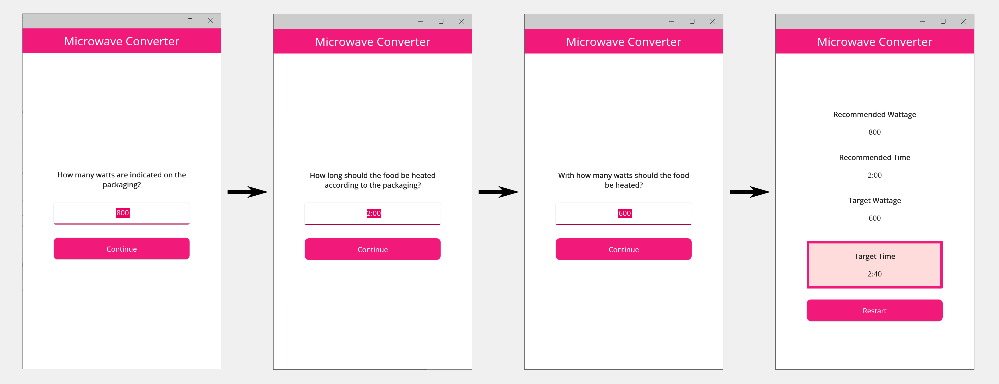

MicrowaveConverter
==================

Introduction
------------

This .NET MAUI application lets the user convert an entered wattage and time of a microwave product to the desired wattage and time.
The user enters the original wattage and time mentioned on the product and then enters the target wattage they want to use for heating the product.
Afterwards, the target time the user has to enter on the microwave is computed and shown.

__Note:__ The app was built and tested for Windows and Android only.

Screenshot
----------



Included dependencies
---------------------

| Dependency                           | Version | Notes                                                     |
|--------------------------------------|---------|-----------------------------------------------------------|
| .NET                                 | 7       |                                                           |
| .NET MAUI                            | 7.0.92  | Used as base framework of the application                 |
| CommunityToolkit.Maui                | 5.3.0   | Used for common functions in MAUI (e.g. for the keyboard) |


Configuration
-------------

There is no configuration file needed.


Structure
---------

The application code contains the following main directories:

* Converters
* Models
* Platforms
* Resources
* Utils
* ViewModels
* Views

In the following, the usage of each mentioned directory is outlined.

__Note:__ 
Since the app has only a very small feature, many directories like 'Converters' or 'Models' only contain one file.
However, the project is structured in the shown way for a better overview and for the case that it gets extended one day.
As an consequence, the descriptions of the converters in the following are mostly general.

### Converters

The 'Converters' directory contains converters, especially those for the .NET MAUI bindings.

To make the converters accessible in each View (i.e. in each XAML file) without importing them all over again,
they are instantiated inside the [Converters.xaml](MicrowaveConverter/Resources/Converters/Converters.xaml) of the
'Resources' directory which is added to the resources of [App.xaml](MicrowaveConverter/App.xaml).

### Models

The 'Models' directory contains the basic data types and services providing the business logic of the application.

The Model classes will be used by the ViewModels to manipulate the data according to the user's wish which is triggered
by the user's actions in the GUI.

Right now, there is only one enumeration [AppStep](MicrowaveConverter/Models/AppStep.cs) contained in the 'Models' directory.
The actual microwave settings data the user enters and that will be computed are only variables of the ViewModel since they are so simple.

### Platforms

The 'Platforms' directory contains platform specific files like the [AndroidManifest.xml](MicrowaveConverter/Platforms/Android/AndroidManifest.xml).
Most of the directories and files are untouched but there also are some modifications made like changing the Android primary color).

### Resources

The 'Resources' directory contains the app resources like icons, styles and translation strings.

Note that many resources are added by default by initializing the project as a .NET MAUI project.
Some of those resources were modified, e.g. the file [Colors.xaml](MicrowaveConverter/Resources/Styles/Colors.xaml) to apply custom colors to the app.

### Utils

The 'Utils' directory contains some basic implementations of the interfaces ICommand and INotifyPropertyChanged.
Thus, the classes actually using those behaviors do not have to implement the functionalities themselves but can rely on this general implementations.

### Views

The 'Views' directory contains the GUI declarations of the application, i.e. the XAML files and their Code-Behinds. 
It does __not__ know the ViewModel but uses bindings to get the runtime values and actions.

### ViewModels

The 'ViewModels' directory contains the ViewModels which provide the presentation logic of the Views but have no direct 
access to the View classes.
Instead, the Views are connected on runtime by bindings to the ViewModel's data and actions.

As an example, the actions triggered by the user in the GUI are declared here.


Build and use the application
-----------------------------

### Windows

Developing the app requires to enable the developer mode in Windows so that the IDE can install and update the app on your machine.
You also might have to install the required workloads e.g. for Android if you have not done this yet.

See https://learn.microsoft.com/en-us/dotnet/maui/windows/deployment/publish-cli for details on how to create a MSIX package for the app.

Since the MSIX package requires a certificate (at least a self-signed one), the process of running the app on a random Windows computer out-of-the box is not possible.

There do exist workarounds with unpackaged applications but they were not working with spaces in the path (e.g. when the username has a space)
and thus they are not mentioned here any further.

### Android

To build the app for Android devices, use the following command:

```
dotnet publish -f net7.0-android -c Release
```

You will receive the APK file inside the generated (or overwritten) directory `bin\Release\net7.0-android\publish` and
can install it via `adb install <My App file>` or via the Android UI.

### iOS

The app was not built and tested for iOS.

### Note for workloads

If you have not already installed all necessary workloads e.g. for Android development with MAUI, you might receive an error message that
you have to install those first before continuing. 